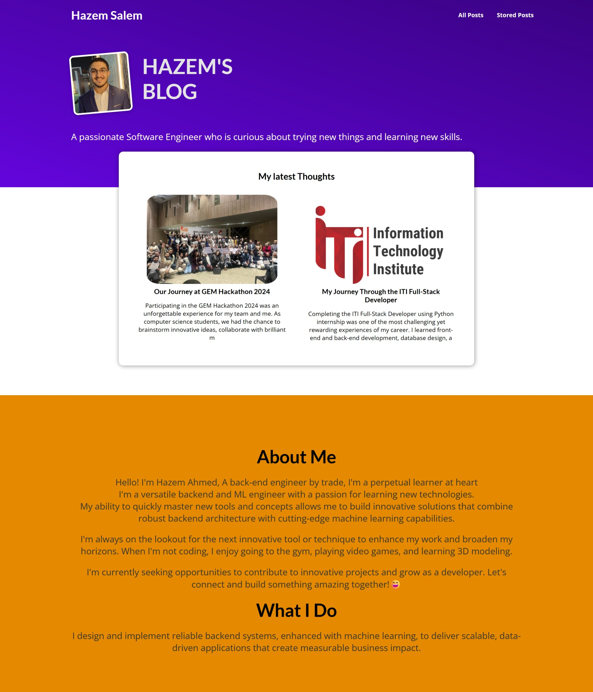
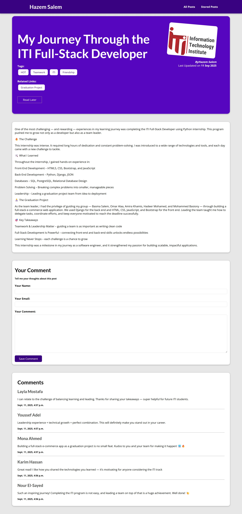
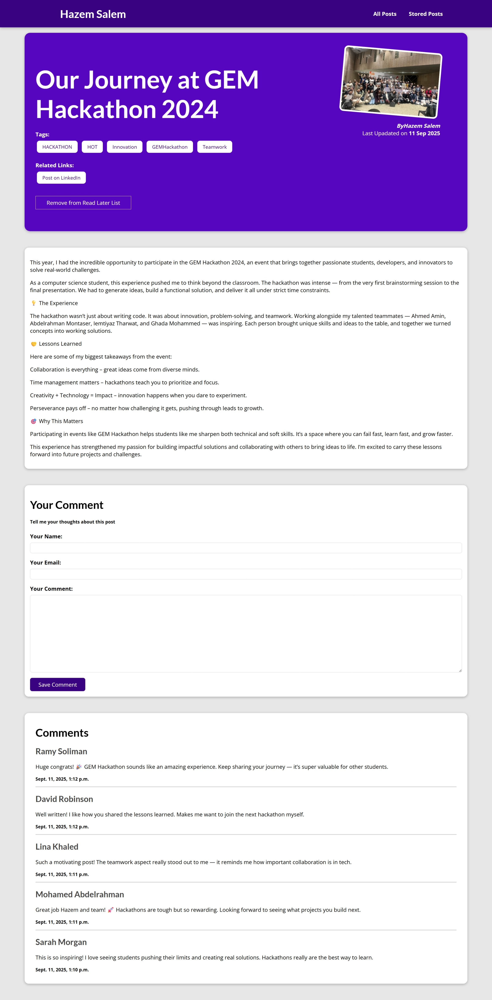
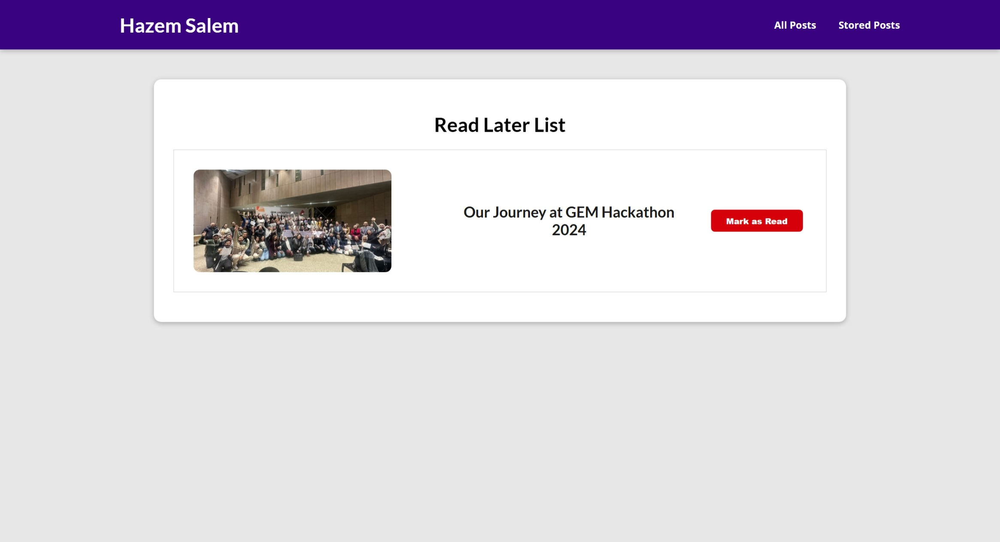
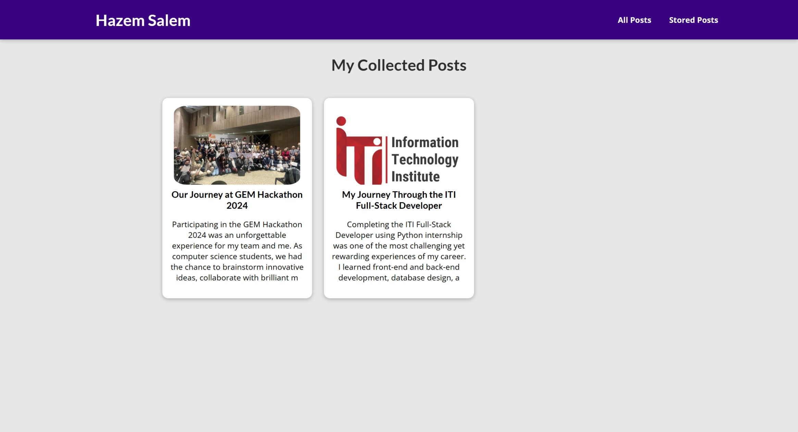
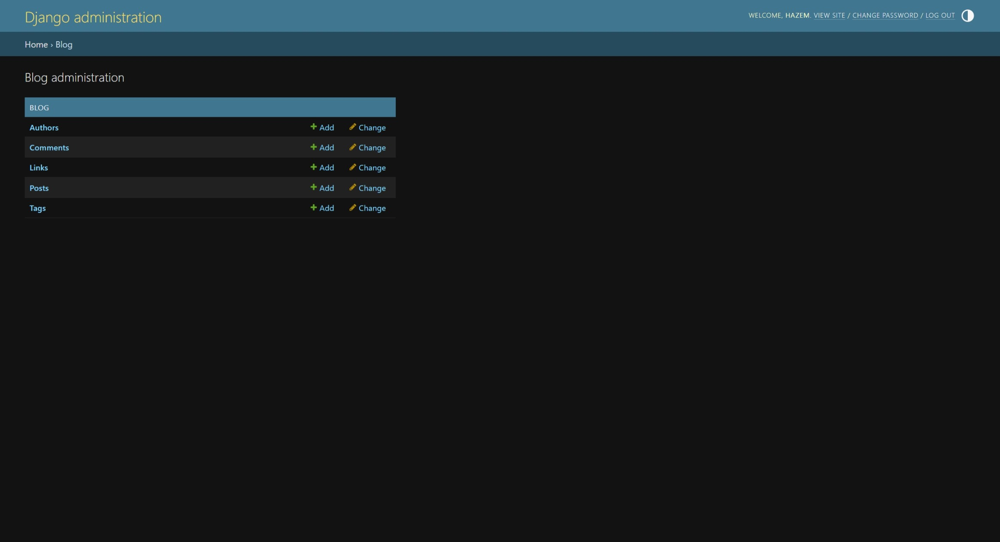

# 📝 Personal Blog Project

A **personal blog** built with **Django**, **HTML**, and **CSS** — perfect for anyone who wants a simple, customizable blog with easy management via **Django Admin**.  
You can easily adapt it to your needs and start publishing posts right away.

---

## 📸 Project Preview

Here’s how the blog looks in action:  

| Home Page | Post Page | Another Post |
|----------|-----------|----------------|
|  |  |  |

| Read-Later Page | Posts-List | Admin Dashboard |
|-------------|-----------|----------------|
|  |  |  |


---

## 🚀 Features

✅ Clean and responsive UI  
✅ Built with Django’s default user model  
✅ Manage posts from Django Admin (create, edit, delete)  
✅ Lightweight and easy to customize  
✅ Simple structure for quick deployment  

---

## ⚙️ Tech Stack

- **Backend:** Django (Python)
- **Frontend:** HTML, CSS
- **Database:** SQLite (default, can be replaced with PostgreSQL/MySQL)

---

## 🛠 Installation & Setup

Follow these steps to run the project locally:

```bash
# 1️⃣ Clone the repository
git clone https://github.com/YOUR_USERNAME/YOUR_REPO_NAME.git
cd YOUR_REPO_NAME

# 2️⃣ Create and activate virtual environment
python -m venv venv
# On Windows
venv\Scripts\activate
# On Mac/Linux
source venv/bin/activate

# 3️⃣ Install dependencies
pip install -r requirements.txt

# 4️⃣ Apply migrations
python manage.py migrate

# 5️⃣ Create a superuser (admin account)
python manage.py createsuperuser

# 6️⃣ Run the development server
python manage.py runserver

```
## 🧑‍💻 Customization Guide

You can easily adapt this blog to your own needs:  

### 1. Update Site Name & Branding
- Create a super user and the site will take the name of the user as the blog's name and other info about the owner of the blog

### 2. Customize Blog Posts models (if you want to add new models to the database)
- Open `blog/models.py` and modify fields if you want to add categories, tags, or featured images.
after making changes.
- Run:

```bash
python manage.py makemigrations && python manage.py migrate
```

### 3. Add Your Data

Use the Django Admin panel (/admin/) to add your own posts, edit existing ones, and manage users.

### 4. Deployment

Configure ALLOWED_HOSTS in (my_site/settings.py).

Use services like Render, Railway, or Heroku to deploy your blog. (The usual Django App Deployment)


### 🤝 Contributing

Contributions are welcome!

#### If you'd like to contribute:

##### 1- Fork the repository
##### 2- Create a new branch (git checkout -b feature-branch)
##### 3- Commit your changes (git commit -m 'Add some feature')
##### 4- Push to the branch (git push origin feature-branch)
##### 5- Open a Pull Request